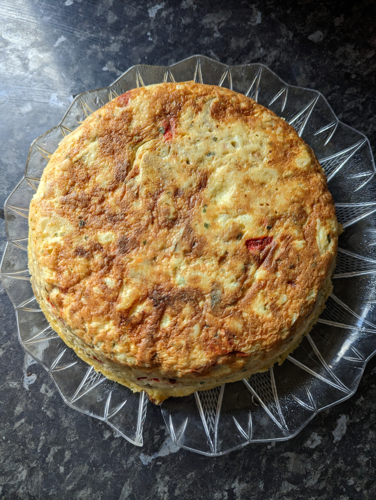

# Ingredients

This is half of the 6+3+1 rule

- 3 eggs
- 1 potato and a half (450gr)
- 1/2 onion 
- parsley and salt

# Instructions 

1. Make the poor potatoes, adding all the ingredients at the same time. Cut the potatoes in half lengthwise, and then slice each half
2. Season with salt and parsley 
3. Beat the eggs with salt and milk, mix everything 
4. Cook the omelette, low heat and covered with a lid

# Result

