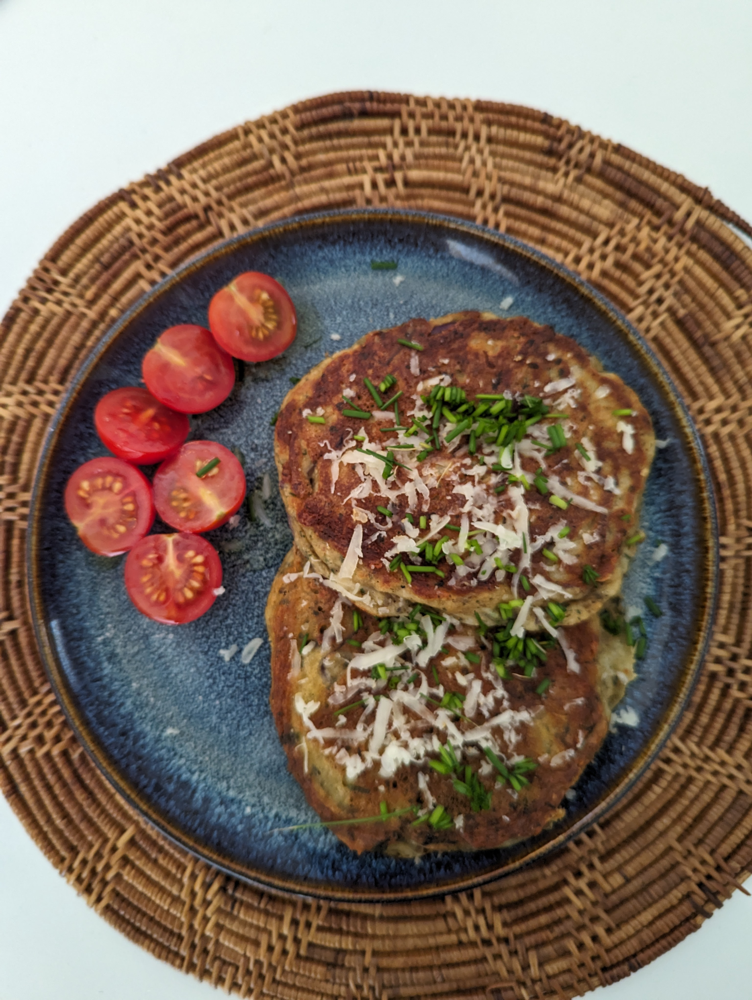

# Ingredients

- 1/4 cup yogurt
- 1 small egg
- 2 tbsp olive oil
- 1/2 cup flour
- 1/2 small onion, finely chopped 
- 1 tbsp coriander
- 1/4 tsp salt
- 1/4 tsp pepper
- 1/4 tsp chilli flakes
- 1/4 tsp baking soda
- 1/2 tsp baking powder
- 1/4 cup cheese

# Instructions

1. Mix  the yogurt, egg and oil in a bowl
2. In a separate bowl, mix the rest of the ingredients
3. Mix both, don't overmix
4. Cook at medium heat for 2-3 minutes each side 

# Result

